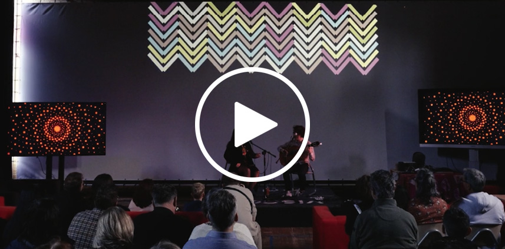

# VJMotion library for Processing

TL;DR [documentation](https://vincentsijben.github.io/vjmotion-processing/) 

## Introduction
VJMotion is a small library for Processing that provides easy to use additional functions for creating animated visuals. This Processing library is designed for live performance, combining BPM-synced animations, real-time audio analysis, and physical input via Arduino. Whether you're building generative art for stage shows, interactive installations, or classroom performances, this toolkit makes it easy to connect sound, motion, and control into one expressive visual experience. 

You could animate (grow or shrink) shapes in any amount of beats, or delay shrinking a shape to start after 6 beats. Or have a shape change it's color using an Arduino potentiometer or based on the volume of some microphone input.
The library builds upon 2 existing libraries: [Arduino (Firmata)](https://github.com/firmata/processing) by David A. Mellis and [Minim](https://code.compartmental.net/minim/) by Damien Di Fede and Anderson Mills.

### Context
This library was originally created in 2023 for the Maastricht Institute of Arts - GenArt exposition. Students were showcasing their generative art work that could be controlled with a custom built Arduino controller. The work was BPM based; a live band performed on stage while students acted as VJ's, controlling their own digital work through the Arduino controller and with most of the visuals animating based on a set BPM. For the exposition and performance of 2024, this library was expanded with 2 additional classes: ArduinoControls (providing additional methods like running code once when someone presses a button) and FrequencyAnalyzer (providing normalized methods for animations based on volume or frequencies).

<table width="100%">
  <tr>
    <td valign="top" align="center" width="50%"> GenArt Expo 2023 (Dutch version)</td>
    <td valign="top" align="center" width="50%"> GenArt Expo 2024 (English version)</td>
  </tr>
 </table>

Students collaborated with several artists in 2024. Click the thumbnail for more information on the artists:

<table width="100%">
  <tr>
    <td valign="top" align="center" width="33%"><a href="https://vincentsijben.github.io/vjmotion-processing/triana-y-luca.html">Triana y Luca </a></td>
    <td valign="top" align="center" width="33%"><a href="https://vincentsijben.github.io/vjmotion-processing/ananya-samyt.html">Ananya Samyt </a></td>
    <td valign="top" align="center" width="33%"><a href="https://vincentsijben.github.io/vjmotion-processing/gogo.html">Gogo </a></td>
  </tr>
 </table>

## Installation
Install the library by downloading the latest release through the Processing Contribution Manager. Open Processing and go to `Sketch > Import Library... > Manage Libraries...` , search for **VJMotion** and click install.
Once installed, check out all the examples in `File > Examples > Contributed Libraries > VJ Motion`.

Please read the [documentation website](https://vincentsijben.github.io/vjmotion-processing/) for more information on how to use this library.
