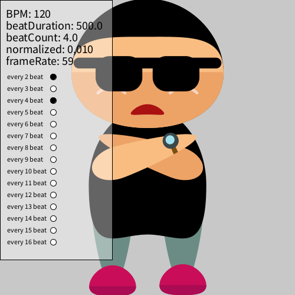
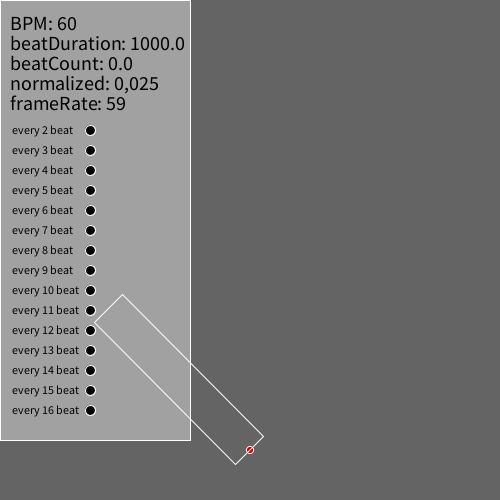

# BPM functions

The BeatsPerMinute class provides the following main functions:

* `linear()` function that returns a normalized linear progress value from 0 to 1 for any given amount of beats, or with a given delay:

    * `linear()` returns progress in 1 beat
    * `linear(4)` returns progress in 4 beats
    * `linear(4,3)` returns progress in 4 beats, with a delay of 3 beats

* `ease()` same as `linear()` but does not use a linear progression but an 'eased' or 'smooth' one. Again, can be called without arguments, with 1 argument (duration in beats) or with two (duration and delay in beats).
* `linearBounce()` same as `linear()` but goes from 0 to 1 to 0 in the same amount of time. Useful for shrinking or growing of visuals.
* `easeBounce()` same as `ease()` but goes from 0 to 1 to 0 in the same amount of time. Useful for shrinking or growing of visuals.
* `every[n]` boolean that returns true every n beats. Returns true for the duration of 1 beat. Limited to a max of 16 beats.
* `every_once[n]` same as `every[n]` but now the boolean returns true for only 1 frame. Useful for changing a variable once every n beats.
* `getBPM()` to return the current BPM.
* `getBeatCount()` to return the current beatcount.
* `getSurfaceTitle()` show information on BPM, beatCount and frameRate in your surface title. To be used in your main sketch like `surface.setTitle(bpm.getSurfaceTitle());`

A more advanced progression function `adsr()` that uses attack, decay, sustain and release options to control the (linear) progression:

* `adsr(0.2)` function that uses an attack of 20% to get from 0 to 1 and stay at 1 for the remainder of the beat
* `adsr(0.2, 0.4, 0.5, 0.1)` function that uses an attack of 20% to get from 0 to 1, a decay of 40% to get to 0.5, stay for 30% of the time at that 0.5 and uses a release of 10% to get from 0.5 to 0.
* `adsr(0.2, 0.4, 0.5, 0.1, 2)` similar as the previous one, but with an additional parameter for duration in beats. In this case to animate over 2 beats.
* `adsr(0.2, 0.4, 0.5, 0.1, 2, 1)` similar as the previous one, but with an additional parameter for delay in beats. In this case delay of 1 beat.

You can tweak the behaviour of this library with the following functions (you can also chain them when initializing your bpm object for clarity):

* `.setBPM(120)` to change the amount of beats per minute for all calculations.
* `.showInfoPanel()` to show the infopanel.
* `.setInfoPanelY(n)` to offset the starting y-position of the infopanel by n pixels. Useful for when you have multiple infopanels to get them all lined up.
* `.setInfoPanelKey('u')` to change the hotkey to toggle the infopanel. Useful for when you have multiple infopanels. Defaults to 'i'.
* `.disableKeyPress()` to disable listening for keypresses. If you don't disable keypresses, then these keypresses will work by default:
  * `0` press once to reset timer, press multiple times to set the BPM to your 'press'-timing
  * `-` lower bpm
  * `+` raise bpm

## Examples
You can find all these examples in `Processing -> File - Examples - Contributed Libraries - VJMotion - BPM`.

<table width="100%">
  <tr>
    <td valign="top" align="center" width="33%"><a href="https://github.com/vincentsijben/vjmotion-processing/blob/main/examples/BPM/animatedSVG/animatedSVG.pde">animatedSVG</a> </td>
    <td valign="top" align="center" width="33%"><a href="https://github.com/vincentsijben/vjmotion-processing/blob/main/examples/BPM/VJMotion/beatcount/beatcount.pde">beatCount</a> </td>
    <td valign="top" align="center" width="33%"><a href="https://github.com/vincentsijben/vjmotion-processing/blob/main/examples/BPM/VJMotion/colorPalettes/colorPalettes.pde">animatedSVG</a> </td>
  </tr>
   <tr>
    <td valign="top" align="center" width="33%"><a href="https://github.com/vincentsijben/vjmotion-processing/blob/main/examples/BPM/VJMotion/delay/delay.pde">delay</a> </td>
    <td valign="top" align="center" width="33%"><a href="https://github.com/vincentsijben/vjmotion-processing/blob/main/examples/BPM/VJMotion/metronome/metronome.pde">metronome</a> </td>
    <td valign="top" align="center" width="33%"><a href="https://github.com/vincentsijben/vjmotion-processing/blob/main/examples/BPM/VJMotion/randomColor/randomColor.pde">randomcolor</a> </td>
  </tr>
  <tr>
    <td valign="top" align="center" width="33%"><a href="https://github.com/vincentsijben/vjmotion-processing/blob/main/examples/BPM/VJMotion/randomGridSpots/randomGridSpots.pde">randomGridSpots</a> </td>
    <td valign="top" align="center" width="33%"><a href="https://github.com/vincentsijben/vjmotion-processing/blob/main/examples/BPM/VJMotion/rotatingSVG/rotatingSVG.pde">rotatingSVG</a> </td>
    <td valign="top" align="center" width="33%"><a href="https://github.com/vincentsijben/vjmotion-processing/blob/main/examples/BPM/VJMotion/adsr/adsr.pde">adsr</a> </td>
  </tr>
 
 </table>